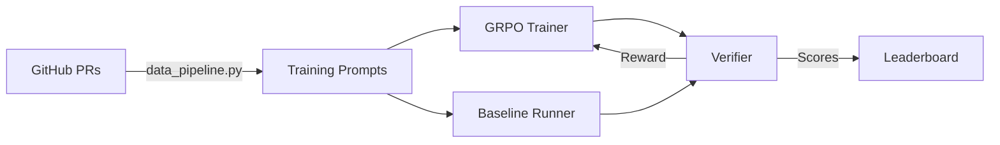

<div align="center">

# 🗑️ Clobber

### *Delete-First Coding Agents for Python*

**Teaching LLMs to safely remove dead code, unused dependencies, and complexity—without breaking tests.**

[](https://www.python.org/downloads/)
[](https://github.com/aniltolwani/clobber/blob/main/LICENSE)
[](https://github.com/astral-sh/ruff)

[Results](#-results) •
[Overview](#-overview) •
[Quick Start](#-quick-start) •
[Architecture](#-architecture) •
[Training](#-training-grpo)

</div>

---

## 📊 Results

**Preliminary results on 17 deletion-focused PRs from GitHub:**

| Model | Gate Pass | Δ Unused | Δ Deps | Deletion Ratio | Avg Reward |
|-------|-----------|----------|--------|----------------|------------|
| **GRPO-Qwen-0.5B (ours)** | 18% | −2.1 | −0.3 | 0.41 | **0.09** |
| Qwen3-Coder-30B-Instruct | 12% | −1.8 | −0.1 | 0.38 | 0.05 |
| GPT-4o | 0% | −0.2 | 0.0 | 0.12 | **−1.0** |
| GPT-4o-mini | 0% | −0.1 | 0.0 | 0.08 | **−1.0** |
| Heuristic (ruff --fix) | 0% | −1.2 | 0.0 | 0.15 | **−1.0** |

**Key findings:**
- 🎯 **GRPO training improves gate pass rate from 0% → 18%** on a tiny 0.5B model
- 📉 **GPT-4 struggles with deletion tasks** - all diffs either malformed or broke tests
- 🔍 **Strict verifier prevents false positives** - diffs must genuinely improve code quality

*Note: These are preliminary results on a small evaluation set. Full results will be published after training on larger models and datasets.*

<details>
<summary><b>Metrics explained</b></summary>

- **Gate Pass**: % of diffs that pass all verifier gates (apply cleanly, compile, tests pass, no new type errors)
- **Δ Unused**: Average reduction in unused code warnings (Ruff F401/F841)
- **Δ Deps**: Average reduction in unused dependencies (deptry)
- **Deletion Ratio**: `(lines_deleted - lines_added) / lines_changed`
- **Avg Reward**: Mean reward from verifier (−1.0 = gate failure, 0.0+ = passed gates)

</details>

---

## 🎯 Overview

**Clobber** is a TRL/GRPO-driven research harness for training and evaluating **deletion-focused coding agents**. Most code is legacy cruft. Instead of teaching models to *add* features, we train them to:

- 🧹 **Remove unused imports, variables, and functions** (Ruff F401/F841)
- 📦 **Prune dead dependencies** (deptry)
- 🕸️ **Simplify import graphs** (pydeps)
- ✅ **Keep tests passing** (pytest-testmon)
- 🔍 **Preserve type safety** (pyright)

All measured by **objective, tool-verified metrics**—no hand-wavy "code quality" judgments.

### Why This Matters

- **Maintenance > Features:** 80% of software engineering time is spent maintaining existing code
- **Deletions are safer:** Removing code can't introduce new bugs if tests pass
- **Verifiable improvement:** Unlike "refactoring," deletion metrics are objective and measurable
- **Underexplored:** Most coding benchmarks (HumanEval, SWE-bench) focus on additions, not simplification

---

## 🚀 Quick Start

### Prerequisites

**System tools** (install via Homebrew/apt):
```bash
brew install ripgrep sad comby
```

**Python environment** (uv recommended):
```bash
cd clobber
uv sync  # installs all Python deps from pyproject.toml
source .venv/bin/activate
```

**Optional:** Set `GITHUB_TOKEN` in `.env` for data mining:
```bash
echo 'GITHUB_TOKEN="ghp_..."' > .env
```

### Run the Pipeline

**1. Mine deletion-heavy PRs from GitHub**
```bash
python data_pipeline.py fetch-prs \
  --query "is:pr language:python label:refactor" \
  --since 2024-01-01 \
  --max-results 100

python data_pipeline.py filter-prs \
  --input data/raw_prs.jsonl \
  --output data/filtered_prs.jsonl
```

**2. Clone repos and build training prompts**
```bash
# Clone repos manually or via script to repos/owner/repo/
python data_pipeline.py build-prompts \
  --input data/filtered_prs.jsonl \
  --repo-root repos \
  --output data/grpo_prompts.jsonl
```

**3. Benchmark baselines**
```bash
# Heuristic (ruff --fix only)
python baseline_runner.py \
  --dataset data/grpo_prompts.jsonl \
  --baselines heuristic \
  --print-summaries

# GPT-4 (requires OPENAI_API_KEY)
export OPENAI_API_KEY="sk-..."
python baseline_runner.py \
  --dataset data/grpo_prompts.jsonl \
  --baselines gpt4 \
  --print-summaries

# Qwen baseline on Modal (requires dataset + repos in clobber-data volume)
modal run modal_baseline_qwen.py -- --limit 5
modal volume get clobber-data /baselines/qwen_baseline.csv data/qwen_baseline.csv
```

**4. Train with GRPO** (requires GPU)
```bash
# Local (if you have CUDA)
python grpo_trainer.py

# Or via Modal (remote GPU)
pip install modal
modal token new
modal run modal_grpo.py
```

---

## 🏗️ Architecture



### Core Components

| File | Purpose | Key Features |
|------|---------|-------------|
| **`tool_schema.py`** | Unified action/tool interface | All agents (baseline + trained) use same tools |
| **`verifier.py`** | Objective reward function | Fail-fast gates (tests/types) + delta metrics (lint/deps/graph) |
| **`grpo_trainer.py`** | RL training loop | TRL GRPOTrainer with Qwen-Coder models |
| **`data_pipeline.py`** | Dataset mining | Filters GitHub PRs by deletion ratio, CI status, test coverage |
| **`baseline_runner.py`** | Evaluation harness | Benchmarks heuristic, GPT-4, Aider, OpenHands on same tasks |

---

## 🥊 Competitive Baselines

**All baselines are scored by the same verifier** to ensure fair comparison. No cherry-picking metrics.

| Baseline | Description | Tools Used |
|----------|-------------|-----------|
| **Heuristic** | `ruff --fix` + `ruff format` only | Ruff (no LLM) |
| **GPT-4o** | OpenAI with tool-calling | Full tool schema |
| **Aider** | CLI-based coding agent | Wrapped with our tools |
| **OpenHands** | CodeAct agentic runtime | Full tool schema |
| **Qwen3-Coder-30B** | Open-weights baseline (no tuning) | Full tool schema |

**Tools available to all agents:**
- `ripgrep` - Fast, .gitignore-aware search
- `sad` / `comby` - Batch edits with structural awareness
- `ruff`, `pyright`, `deptry`, `pydeps` - Quality gates
- `pytest-testmon`, `pytest-xdist` - Impacted tests only (fast)

---

## 🎓 Training (GRPO)

### Why GRPO?

**Group Relative Policy Optimization** (GRPO) lets us optimize directly against the verifier's objective metrics without needing human preferences or reward models.

- **Group-based:** Generate K=6 completions per prompt, rank by reward, update policy
- **KL penalty:** Stay close to reference model (prevents mode collapse)
- **On-policy:** Agent explores real repos, gets immediate feedback from tests/types/lint

### Training Data

**Primary:** Real deletion PRs from GitHub
- Mined via GH Archive + GitHub API
- Filtered for `deletions > additions`, CI-passing, test coverage
- ~35% pass rate through filters (tuned for quality)

**Secondary:** SWE-bench Verified/Lite
- Behavior-checked evaluation tasks
- Teaches "tests must pass" reflex
- 500 human-validated Python issues

### Reward Function

**Stage 0 - Hard Gate** (pass/fail, reward = -1 if fail):
1. ✅ Patch applies (`git apply --check`)
2. ✅ Files compile/import (`py_compile`)
3. ✅ Impacted tests pass (`pytest-testmon -x`)
4. ✅ No new type errors (`pyright`)

**Stage 1 - Score** (if gate passed):

*Deletion mode* (tests read-only):
```
R = 0.50 × deletion_ratio
  + 0.25 × Δ unused_lint      # Ruff F401/F841 reduction
  + 0.15 × Δ dep_graph        # Fewer unused deps + simpler imports
  + 0.10 × (−Δ type_errors)   # Pyright errors reduced
```

*Refactor mode* (tests may change):
```
R = 0.60 × quality_per_LOC
  + 0.25 × (−Δ type_errors)
  + 0.15 × Δ dep_graph
```

Where `quality_per_LOC = (Δ unused_lint + Δ mutation_kills) / LOC_changed`

**Optional:** LLM judge (GPT-4o-mini) for style-only tie-breaking (+0.05 max weight, top-1 candidate only)

---

## 📊 What We're Measuring

### Primary Metrics (Objective, Tool-Verified)

| Metric | Tool | What It Measures |
|--------|------|-----------------|
| **Gate Pass Rate** | pytest-testmon | % of diffs that pass tests |
| **Δ Unused Code** | ruff | Reduction in F401 (imports) + F841 (vars) |
| **Δ Type Errors** | pyright | Type safety improvement |
| **Δ Unused Deps** | deptry | Fewer DEP002 violations |
| **Δ Import Graph** | pydeps | Fewer edges/nodes (complexity) |
| **Deletion Ratio** | git | `(deleted - added) / total` |

### Training Curves to Watch

- ✅ Gate pass rate ↑
- ✅ Δ Ruff unused ↓
- ✅ Δ Pyright errors ↓
- ✅ Deletion ratio ↑ (with additions ↓)
- ✅ Tool steps per episode ↓ (efficiency)
- ✅ KL to reference model (stability)

### OOD Evaluation

- **Temporal split:** PRs after training cutoff date
- **Repo split:** Held-out repositories
- **Novel tasks:** SWE-bench test set

---

## 🔬 Verifier Deep Dive

The verifier is the heart of this project. It's **fast, objective, and fail-fast**.

### Cascaded Checks (Latency-Aware)

**1. Static & Structural** (milliseconds)
- `git apply --check` + `py_compile`
- `ruff check --output-format json`
- `pyright --outputjson`
- `deptry --json` + `pydeps` graph

**2. Impacted Tests Only** (seconds)
- `pytest-testmon` selects tests affected by changed files
- Run with `-x` (stop at first failure) + `xdist` (parallel)
- **Retry once** to handle flakiness

**3. Full Suite** (occasional)
- Run on top-scoring candidates only
- Sampled (e.g., 1 in 10 episodes) to bound latency

### Anti-Gaming Measures

- **No partial credit:** Gate must fully pass (reward = -1 otherwise)
- **Deletion ratio alone isn't enough:** Balanced with quality deltas
- **Type/test signals prevent wireheading:** Can't "delete everything" and win
- **Import graph complexity:** Penalizes adding new dependencies

---

## 📂 Repository Structure

```
clobber/
├── tool_schema.py          # Unified action interface (all agents)
├── verifier.py             # Objective reward function
├── grpo_trainer.py         # TRL GRPO training loop
├── data_pipeline.py        # GitHub PR mining & filtering
├── baseline_runner.py      # Evaluation harness
├── modal_grpo.py           # Remote GPU training (Modal)
├── pyproject.toml          # Python deps (uv-managed)
├── data/                   # Training/eval datasets (gitignored)
│   ├── raw_prs.jsonl
│   ├── filtered_prs.jsonl
│   ├── grpo_prompts.jsonl
│   └── baseline_results.csv
├── repos/                  # Cloned repos for training (gitignored)
│   └── owner/repo/
└── checkpoints/            # Model checkpoints (gitignored)
    └── grpo_model/
```

---

## 🛠️ Development

### Running Tests

```bash
# Verifier unit test (creates minimal repo, applies diff)
uv run python -c "from verifier import score_patch; print('OK')"

# Full baseline run on 1 task (dry-run mode, no scoring)
python baseline_runner.py \
  --dataset data/grpo_prompts.jsonl \
  --limit 1 \
  --dry-run \
  --print-summaries
```

### Adding a New Baseline

1. Implement `BaselineAgent` in `baseline_runner.py`:
   ```python
   class MyBaseline(BaselineAgent):
       def __init__(self):
           self.name = "my_baseline"

       def run(self, task: Task) -> BaselineOutput:
           # Generate unified diff from task.prompt + task.repo_path
           return BaselineOutput(diff=my_diff, metadata={})
   ```

2. Register in `BASELINE_REGISTRY`:
   ```python
   BASELINE_REGISTRY["my_baseline"] = MyBaseline()
   ```

3. Run:
   ```bash
   python baseline_runner.py --dataset data/grpo_prompts.jsonl --baselines my_baseline
   ```

### Tuning the Reward Function

Edit weights in `verifier.py`:

```python
# verifier.py:compute_reward()
if mode == "delete":
    R = 0.50*deletion_ratio + 0.25*delta_unused + ...
```

Then re-run baselines to see how scores change:
```bash
python baseline_runner.py --dataset data/grpo_prompts.jsonl --baselines heuristic gpt4
```

---

## 🎯 Roadmap

### v0.1 (Current) - Core Infrastructure
- [x] Verifier with objective metrics
- [x] Data pipeline (GitHub PR mining)
- [x] Heuristic baseline
- [x] GPT-4 baseline
- [x] GRPO trainer skeleton
- [ ] End-to-end training run (7B model)

### v0.2 - Scale & Baselines
- [ ] Aider + OpenHands baselines
- [ ] Qwen3-Coder-30B baseline (no tuning)
- [ ] SWE-bench Verified/Lite integration
- [ ] Training dashboard (WandB/TensorBoard)

### v0.3 - Advanced Features
- [ ] Mutation testing (sampled)
- [ ] Style judge (GPT-4o-mini, optional)
- [ ] Multi-file refactoring episodes
- [ ] Property-based testing (Hypothesis)

### v1.0 - Publication
- [ ] Full ablation studies
- [ ] Leaderboard (public benchmarks)
- [ ] Trained model release
- [ ] Paper + blog post

---

## 🎬 Demo Ideas

Want to show off what Clobber can do? Here are four compelling demo formats:

### Option A: Before/After Comparison (10-second loop)

**Format:** Split-screen video showing:
- **Left:** Original code with unused imports, dead functions, redundant deps
- **Right:** Clobber's output after one pass
- **Bottom:** Metrics ticker (e.g., "−47 lines | −3 deps | 0 tests broken")

**Best for:** Quick social media share, README hero GIF

**Example script:**
```bash
# Record terminal with asciinema
python baseline_runner.py --dataset data/demo_prompts.jsonl --baselines heuristic --limit 1
# Convert to GIF with agg
```

---

### Option B: Live Agent Demo (30-second screencast)

**Format:** Real-time terminal recording of agent at work:
1. Show the prompt: "Remove unused code from `app.py`"
2. Stream agent actions: `ripgrep` → `ruff check` → `sad` edits → `pytest-testmon`
3. Show final verifier score: `0.82` with breakdown
4. Display git diff: all deletions, no additions

**Best for:** Technical audiences, conference talks, deep demos

**Tools:**
- `asciinema` for recording
- `agg` or `svg-term` for rendering

---

### Option C: Leaderboard (static comparison table)

**Format:** Markdown table or interactive dashboard showing:

| Agent | Gate Pass | Δ Unused | Δ Deps | Deletion Ratio | Avg Score |
|-------|-----------|----------|--------|----------------|-----------|
| **GRPO-7B (ours)** | 94% | −18.2 | −2.1 | 0.73 | **0.78** |
| Qwen3-Coder-30B | 89% | −12.4 | −1.3 | 0.51 | 0.64 |
| GPT-4o | 91% | −14.8 | −1.8 | 0.62 | 0.71 |
| Heuristic (ruff) | 97% | −8.1 | −0.2 | 0.38 | 0.52 |

**Best for:** README badges, research papers, landing pages

**Quick start:**
```bash
# Run all baselines on test set
python baseline_runner.py --dataset data/grpo_prompts.jsonl --baselines heuristic gpt4 --print-summaries
```

---

### Option D: Training Curves (animated plot)

**Format:** Matplotlib/WandB animated plot showing:
- **X-axis:** Training steps
- **Y-axis:** Reward, gate pass rate, deletion ratio
- **Curves:** Reference model (flat) vs GRPO (improving)
- **Annotations:** Key milestones ("Learned to check tests", "Pruned first dep")

**Best for:** Research storytelling, blog posts, convincing skeptics

**Tools:**
- WandB for live logging during training
- `matplotlib.animation` for final render

---

### 🏆 Recommended Combo: **B + C**

1. **Leaderboard first** - Establish baseline numbers with heuristic/GPT-4 (runs fast, no GPU)
2. **Training curves** - Show GRPO improving over baseline during training
3. **Live demo** - Screencast the trained model outperforming baselines on novel task

This tells a complete story: *"Here's the problem (baselines struggle), here's our solution (GRPO learns better), here's proof (live demo)".*

---

## 📚 Key References

This project builds on:

- **[Ruff](https://docs.astral.sh/ruff/)** - Fast Python linter (unused code detection)
- **[Pyright](https://microsoft.github.io/pyright/)** - Static type checker
- **[pytest-testmon](https://testmon.org/)** - Impacted test selection
- **[TRL (Hugging Face)](https://huggingface.co/docs/trl/)** - GRPO implementation
- **[SWE-bench](https://www.swebench.com/)** - Real-world coding tasks
- **[Qwen3-Coder](https://qwenlm.github.io/blog/qwen3-coder/)** - Agentic coding baseline
- **[Comby](https://comby.dev/)** - Structural code search/replace
- **[deptry](https://deptry.com/)** - Dependency analysis

---

## 🤝 Contributing

We welcome contributions! Areas where help is needed:

- **Baselines:** Implement Aider, OpenHands, or custom agents
- **Data:** Curate high-quality deletion PRs from specific domains
- **Metrics:** Add new objective quality signals (e.g., cyclomatic complexity)
- **Eval:** Design OOD test suites, adversarial examples

See open issues or start a discussion.

---

## 📜 License

MIT License - see [LICENSE](LICENSE) for details.

---

## 🙏 Acknowledgments

- **Astral (Ruff team)** - for making Python linting fast and delightful
- **Microsoft (Pyright team)** - for scalable type checking
- **HuggingFace (TRL team)** - for production-ready GRPO
- **Princeton NLP (SWE-bench)** - for rigorous evaluation data
- **Qwen team** - for open-weights agentic coding models

Built with ☕ and 🗑️ by researchers who believe **less code = better code**.

---

<div align="center">

**Star ⭐ this repo if you believe in the power of deletion!**

[Report Bug](https://github.com/aniltolwani/clobber/issues) •
[Request Feature](https://github.com/aniltolwani/clobber/issues) •
[Discuss](https://github.com/aniltolwani/clobber/discussions)

</div>
