<div align="center">

# Clobber

### *Claude adds slop. Clobber deletes it.*

**A coding agent trained to remove unused code, dependencies, and complexity.**

[](https://www.python.org/downloads/)
[](https://github.com/aniltolwani/clobber/blob/main/LICENSE)
[](https://github.com/astral-sh/ruff)

</div>

---

## Results

**Evaluation on 17 deletion-focused PRs:**

| Model | Gate Pass | Avg Score | Δ Unused | Δ Deps | Deletion Ratio |
|-------|-----------|-----------|----------|--------|----------------|
| **GRPO-Qwen-0.5B** | **18%** | **0.09** | −2.1 | −0.3 | 0.41 |
| Qwen3-Coder-30B | 12% | 0.05 | −1.8 | −0.1 | 0.38 |
| GPT-4o | 0% | −1.0 | −0.2 | 0.0 | 0.12 |
| GPT-4o-mini | 0% | −1.0 | −0.1 | 0.0 | 0.08 |
| Heuristic (ruff) | 0% | −1.0 | −1.2 | 0.0 | 0.15 |

**Key findings:** GRPO training improves gate pass rate from 0% → 18% on a 0.5B model. Even GPT-4 struggles with deletion tasks.

<details>
<summary>Metrics explained</summary>

- **Gate Pass**: % passing all verifier gates (applies cleanly, compiles, tests pass, no new type errors)
- **Avg Score**: Mean verifier reward (−1.0 = gate failure, 0.0+ = passed)
- **Δ Unused**: Reduction in unused code warnings (Ruff F401/F841)
- **Δ Deps**: Reduction in unused dependencies (deptry)
- **Deletion Ratio**: (lines_deleted − lines_added) / lines_changed

</details>

---

## Overview

Clobber trains coding agents to remove unused code, dependencies, and complexity while keeping tests passing. All improvements are measured by objective, tool-verified metrics.

---

## Architecture

```mermaid
graph LR
    subgraph Data["📦 Data Pipeline"]
        A[GitHub PRs] --> B[Filter<br/>deletions > adds]
        B --> C[Training<br/>Prompts]
    end

    subgraph Training["🔄 Training Loop"]
        D[GRPO<br/>Trainer] --> E[Generate<br/>K=6 diffs]
        E --> F[Verifier]
        F --> G{Gates<br/>Pass?}
        G -->|Yes| H[Score<br/>Metrics]
        G -->|No| I[R = -1.0]
        H --> J[Reward]
        I --> J
        J -->|Update| D
    end

    subgraph Eval["📊 Evaluation"]
        K[Baselines<br/>GPT-4, etc.] --> F
        F --> L[Leaderboard]
    end

    C --> D
    C --> K

    style F fill:#f9f,stroke:#333,stroke-width:2px
    style D fill:#bbf,stroke:#333,stroke-width:2px
    style L fill:#bfb,stroke:#333,stroke-width:2px
```



### Core Components

| File | Purpose |
|------|---------|
| `tool_schema.py` | Unified action interface for all agents |
| `verifier.py` | Objective reward function with fail-fast gates |
| `grpo_trainer.py` | TRL GRPO training loop |
| `data_pipeline.py` | Dataset mining from GitHub PRs |
| `baseline_runner.py` | Evaluation harness for benchmarking |

---

## Baselines

All baselines use the same verifier for fair comparison.

| Baseline | Description | Tools |
|----------|-------------|-------|
| Heuristic | `ruff --fix` + `ruff format` only | Ruff (no LLM) |
| GPT-4o | OpenAI with tool-calling | Full tool schema |
| Aider | CLI-based coding agent | Wrapped with tools |
| OpenHands | CodeAct agentic runtime | Full tool schema |
| Qwen3-Coder-30B | Open-weights baseline (no tuning) | Full tool schema |

**Tools available:** ripgrep, sad/comby, ruff, pyright, deptry, pydeps, pytest-testmon

---

## Quick Start

### Prerequisites

```bash
# System tools
brew install ripgrep sad comby

# Python environment
cd clobber
uv sync
source .venv/bin/activate

# Optional: Set API keys in .env
echo 'GITHUB_TOKEN="ghp_..."' > .env
echo 'OPENAI_API_KEY="sk-..."' >> .env
```

### Run the Pipeline

**1. Mine deletion PRs**
```bash
python data_pipeline.py fetch-prs \
  --query "is:pr language:python label:refactor" \
  --since 2024-01-01 \
  --max-results 100

python data_pipeline.py filter-prs \
  --input data/raw_prs.jsonl \
  --output data/filtered_prs.jsonl
```

**2. Build training prompts**
```bash
python data_pipeline.py build-prompts \
  --input data/filtered_prs.jsonl \
  --repo-root repos \
  --output data/grpo_prompts.jsonl
```

**3. Benchmark baselines**
```bash
# Heuristic (ruff --fix)
python baseline_runner.py \
  --dataset data/grpo_prompts.jsonl \
  --baselines heuristic \
  --print-summaries

# GPT-4
python baseline_runner.py \
  --dataset data/grpo_prompts.jsonl \
  --baselines gpt4 \
  --print-summaries
```

**4. Train with GRPO**
```bash
# Local (if you have CUDA)
python grpo_trainer.py

# Or via Modal (remote GPU)
modal token new
modal run modal_grpo.py
```

---

## Training

We use Group Relative Policy Optimization (GRPO) to optimize directly against verifier metrics. Generates 6 completions per prompt, ranks by reward, updates policy with KL penalty.

Training data: Real deletion PRs from GitHub (filtered for deletions > additions, CI-passing) + SWE-bench Verified tasks.

### Reward Function

**Hard gates** (pass/fail, reward = -1 if any fail):
1. Patch applies (`git apply --check`)
2. Files compile (`py_compile`)
3. Tests pass (`pytest-testmon -x`)
4. No new type errors (`pyright`)

**Scoring** (if gates pass):
- Deletion mode: `R = 0.50×deletion_ratio + 0.25×Δ_unused + 0.15×Δ_deps + 0.10×(−Δ_type_errors)`
- Refactor mode: `R = 0.60×quality_per_LOC + 0.25×(−Δ_type_errors) + 0.15×Δ_deps`

---

## Verifier

Fast, objective fail-fast checker. Runs static analysis (ms), then impacted tests only (seconds), then full suite (occasional, sampled).

Anti-gaming: No partial credit. Deletion ratio balanced with quality deltas. Type/test signals prevent "delete everything" wireheading.

---

## Repository Structure

```
clobber/
├── tool_schema.py          # Unified action interface
├── verifier.py             # Objective reward function
├── grpo_trainer.py         # TRL GRPO training loop
├── data_pipeline.py        # GitHub PR mining
├── baseline_runner.py      # Evaluation harness
├── modal_grpo.py           # Remote GPU training (Modal)
└── tests/                  # Unit tests
```

---

## TODO

- [x] End-to-end training run (7B model)
- [ ] Add Aider + OpenHands baselines
- [ ] SWE-bench Verified/Lite integration
- [ ] Training dashboard (WandB/TensorBoard)
- [ ] Full ablation studies
- [ ] Trained model release
